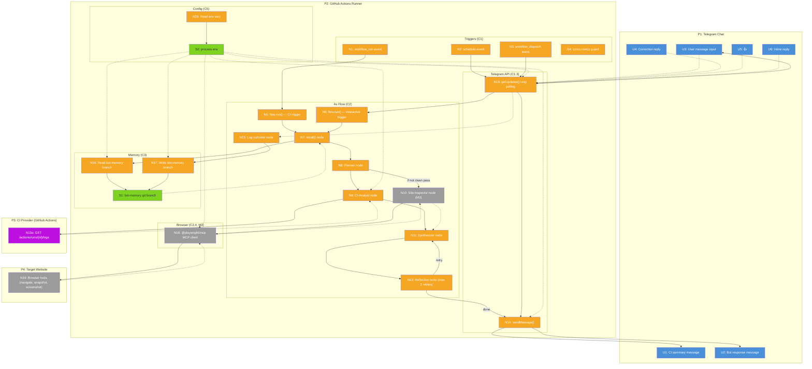

# Groundcrew — Breadboard: Shape C (Ax on GitHub Actions)

> Input from shaping: `ci-telegram-bot-shaping.md` (Shape C, components C1–C6, milestones M1–M5). Related: `ADR-001-bot-runtime-decision.md`, `Unified-MCP-Architecture.md`, `self-improving.md`.

---

## Places

| # | Place | Description |
|---|-------|-------------|
| P1 | Telegram Chat | Where the user sees CI summaries, sends messages, receives responses, and reacts with corrections or confirmation |
| P2 | GitHub Actions Runner | Where triggers fire, the Ax flow executes, API calls happen, memory is read/written, browser runs |
| P3 | CI Provider (GitHub Actions) | External system: CI workflows run here, their completion triggers the bot. Logs are fetched from here via REST API |
| P4 | Target Website | External system: the live website the bot inspects (M3). Browser navigates here via `@playwright/mcp` |

---

## UI Affordances

| # | Place | Component | Affordance | Control | Wires Out | Returns To |
|---|-------|-----------|------------|---------|-----------|------------|
| U1 | P1 | telegram-chat | CI summary message | render | — | — |
| U2 | P1 | telegram-chat | Bot response message | render | — | — |
| U3 | P1 | telegram-chat | User message input | type | → N15 | — |
| U4 | P1 | telegram-chat | Correction reply | type | → N15 | — |
| U5 | P1 | telegram-chat | Thumbs up (👍) | click | → N15 | — |
| U6 | P1 | telegram-chat | Inline reply to bot's message | type | → N15 | — |

> **U1** is the M1 affordance: the bot posts a CI summary, the user sees it.
> **U2–U6** are M2 affordances: interactive chat session. U3 is the user asking a question. U2 is the bot's response. U4/U5/U6 are how the user gives feedback (correction text, thumbs up, or inline reply). All user input reaches the bot via N15 (Telegram long polling).

---

## Code Affordances

### Triggers (C1)

| # | Place | Component | Affordance | Control | Wires Out | Returns To |
|---|-------|-----------|------------|---------|-----------|------------|
| N1 | P2 | workflow-trigger | `workflow_run` event | event | → N5 | — |
| N2 | P2 | workflow-trigger | `schedule` event | event | → N14, → N15 | — |
| N3 | P2 | workflow-trigger | `workflow_dispatch` event | event | → N14, → N15 | — |
| N4 | P2 | workflow-trigger | `concurrency` guard | guard | — | — |

> N1 is the M1 trigger: CI completes → bot runs. N2/N3 are M2 triggers: scheduled or manual session start. N4 prevents overlapping sessions (one bot token = one long-polling session at a time).

### Telegram integration (C1.3)

| # | Place | Component | Affordance | Control | Wires Out | Returns To |
|---|-------|-----------|------------|---------|-----------|------------|
| N14 | P2 | telegram-api | `sendMessage()` | call | — | → U1, → U2 |
| N15 | P2 | telegram-api | `getUpdates()` long polling | call | → N6 | → U3, U4, U5, U6 |

> N14 posts messages to Telegram (CI summary in M1, responses in M2). N15 is long polling — receives user messages, corrections, and reactions during an interactive session (M2). Returns the raw user input to the Ax flow entry point (N6).

### Ax flow (C2)

| # | Place | Component | Affordance | Control | Wires Out | Returns To |
|---|-------|-----------|------------|---------|-----------|------------|
| N5 | P2 | ax-flow | `flow.run()` entry | call | → N7, → N8 | — |
| N6 | P2 | ax-flow | `flow.run()` entry (interactive) | call | → N7, → N8 | — |
| N7 | P2 | ax-flow | `recall()` node | call | → N16 | → N8 |
| N8 | P2 | ax-flow | Planner node | call | → N9, → N10 | → N11 |
| N9 | P2 | ax-flow | CI-Analyst node | call | → N13 | → N11 |
| N10 | P2 | ax-flow | Site-Inspector node (M3) | call | → N18 | → N11 |
| N11 | P2 | ax-flow | Synthesizer node | call | → N12 | → N14 |
| N12 | P2 | ax-flow | Reflection node (max 2 retries) | call | → N11, → N14 | — |
| N13 | P2 | ax-flow | Log outcome node | call | → N17 | — |

> **N5** is the M1 entry: `workflow_run` → run the flow (recall → plan → analyze → synthesize → reflect → send → log).
> **N6** is the M2 entry: user message → run the flow with the user's question as input. Same flow, different entry trigger.
> **N10** (Site-Inspector) is M3 only. The Planner (N8) conditionally invokes it — only when the CI verdict isn't a clean pass and a live site inspection is needed.
> **N12** (Reflection) loops back to N11 (Synthesizer) up to 2 times if the self-critique finds issues, then wires to N14 (Send) when satisfied or retries exhausted.
> **N13** (Log outcome) runs after the message is sent — logs whether the user accepted or corrected the response.

### External API calls (C1.3)

| # | Place | Component | Affordance | Control | Wires Out | Returns To |
|---|-------|-----------|------------|---------|-----------|------------|
| N13a | P3 | github-api | `GET /repos/{owner}/{repo}/actions/runs/{id}/logs` | call | — | → N9 |

> N13a fetches CI run logs from the GitHub Actions REST API. The CI-Analyst node (N9) calls it, receives the logs, then sends the relevant parts to the LLM for analysis. Only relevant parts are sent to the LLM (R7.1 — token efficiency).

### Memory store (C3)

| # | Place | Component | Affordance | Control | Wires Out | Returns To |
|---|-------|-----------|------------|---------|-----------|------------|
| N16 | P2 | memory-store | Read memory from `bot-memory` branch | call | → S1 | → N7 |
| N17 | P2 | memory-store | Write outcome + corrections to `bot-memory` branch | call | → S1 | — |

> N16 runs at the start of each execution: clones the `bot-memory` branch, reads past executions and corrections. Returns relevant memories to `recall()` (N7). N17 runs at the end: commits the outcome (accepted/corrected) and any correction text, pushes to the branch. This is the self-improvement v1 mechanism (recall + feedback logging, per `self-improving.md`).

### Browser inspection (C2.4, M3)

| # | Place | Component | Affordance | Control | Wires Out | Returns To |
|---|-------|-----------|------------|---------|-----------|------------|
| N18 | P2 | site-inspector | `@playwright/mcp` MCP client (Cloudflare CDP default, local Chromium fallback) | call | → N19 | → N10 |
| N19 | P4 | site-inspector | Browser tools (navigate, snapshot, screenshot, evaluate) | call | — | → N18 |

> N18 starts or connects to the browser via `@playwright/mcp`. Local Chromium by default; Cloudflare CDP endpoint if `CF_BROWSER_ENDPOINT` env var is set (hybrid architecture per `Unified-MCP-Architecture.md`). N19 is the set of MCP tools the LLM calls in a ReAct loop: `browser_navigate`, `browser_snapshot`, `browser_take_screenshot`, `browser_evaluate`. Observations return to the Site-Inspector node (N10), which passes them to the Synthesizer (N11).

### Config (C5)

| # | Place | Component | Affordance | Control | Wires Out | Returns To |
|---|-------|-----------|------------|---------|-----------|------------|
| N20 | P2 | config | Read env vars (`process.env` / GitHub Actions secrets) | read | → S2 | → N9, → N14, → N15, → N16, → N17, → N18 |

> N20 is the config layer. All team-specific values (GitHub token, Telegram bot token, chat ID, target website URL, LLM API key, optional Cloudflare credentials) are read from environment variables at runtime. Never committed (R6.2).

---

## Data Stores

| # | Place | Store | Description |
|---|-------|-------|-------------|
| S1 | P2 | `bot-memory` git branch | Files: past executions, outcomes (accepted/corrected), human corrections, tagged by topic. Read at start of each run (N16), written at end (N17). Versioned, readable, no database. |
| S2 | P2 | `process.env` | Configuration: `GITHUB_TOKEN`, `TELEGRAM_BOT_TOKEN`, `TELEGRAM_CHAT_ID`, `TARGET_URL`, `LLM_API_KEY`, optional `CF_BROWSER_ENDPOINT`, `CF_API_TOKEN`. Supplied via GitHub Actions secrets. |

---

## Mermaid Diagram

---

## Slicing Notes

The breadboard reveals three natural vertical slices aligned with milestones:

### M1 — CI Summary (vertical slice 1)

**Flow:** N1 → N5 → N7 → N16 → S1 → N8 → N9 → N13a → N11 → N12 → N14 → U1 → N13 → N17 → S1

**What's demo-able:** A CI run completes. The bot posts a summary to Telegram. The user sees it. The outcome is logged to the `bot-memory` branch.

**Affordances in scope:** N1, N5, N7, N8, N9, N11, N12, N13, N13a, N14, N16, N17, N20, S1, S2, U1

**Deferred:** N2, N3, N4, N6, N10, N15, N18, N19, U2, U3, U4, U5, U6

### M2 — Interactive Chat (vertical slice 2)

**Adds:** N2, N3, N4, N6, N15, U2, U3, U4, U5, U6

**What's demo-able:** User sends a message to the bot in Telegram. Bot responds with CI data. User corrects the bot. Correction is logged.

### M3 — Browser Inspection (vertical slice 3)

**Adds:** N10, N18, N19

**What's demo-able:** CI fails. Bot opens the live website, inspects it, combines observations with CI data in the summary.
